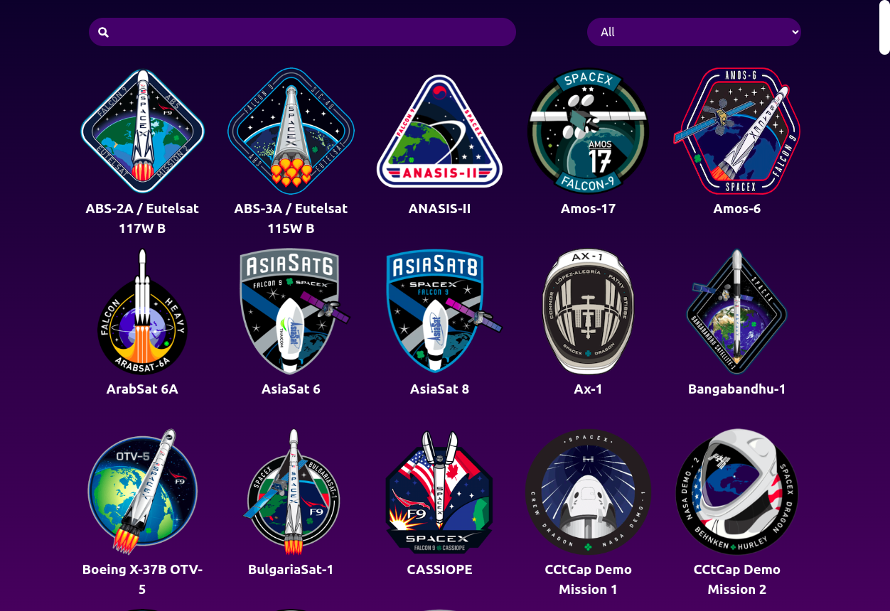

# SpaceX Launch Information Page

**A simple website gathering information about spaceX launches, using [SpaceX API](https://github.com/r-spacex/SpaceX-API).**


## Screenshots
<p align="center">
  
</p>


## Services:
* `spaceXAPI.ts:` functions that call SpaceX API:
  * *fetchRequest:* helper fetching function with global error handler,
  * *getAllLaunches:* API call for all launched data, populated with additional data for rocket, launchpads and crew,
  * *getLaunch:* API call for data for one launch based on its id,
  * *getFilteredLaunches:* API call for filtered launch data in three categories: upcoming, successful and failed.
* `fuseSearch.ts:` helper search function, accommodation fuzzy search using Fuse.js library. It searches through the following data from launches: launch name, rocket name, launchpad name and names of the crew. Fields can be adjusted in `fuseSearch.ts`.
* `dateFormatter.ts:` date formatter for displaying launch details.


## Components:
* `LaunchDashboard.tsx:` main app route - container component with main app logic for the launches list and the search/ filter functionality. It uses state and functions from `spaceXAPI.ts`: *getAllLaunches* and *getFilteredLaunches*. It also uses helper function *fuseSearch* from `fuseSearch.ts` to fuzzy search fetched or filtered launches.
* `LaunchList.ts:` presentational component for the launches list. It takes launches list as a prop from *LaunchDashboard*.
* `LaunchItem.ts:` presentational component for a single launch. It takes launch data as a prop from *LaunchList*.
* `LaunchDetails.ts:` seperate App Route, component that displays detailed information about each launch. It uses state and functions from `spaceXAPI.ts`: *getLaunch* based on the id parameter from the route path.
* `Spinner.ts:` spinner displayed while fetching API data.

Information about all components are also summerized here:
*styleguide/index.html*.


## Deployment
1. Make sure you have `git`, `node` and `npm` installed. 

2. Clone this repo and enter.

    ```bash
    git clone https://github.com/katarzynabogumil/spacex
    cd spacex
    ```

3. Install dependencies and run server.

   ```bash
   npm install
   npm run start
   ```


## Techstack
* [React](https://react.dev/)
* Testing:
  * [Jest](https://jestjs.io/)
  * [Cypress](https://www.cypress.io/)
* Other dependencies
  * [Typescript](https://www.typescriptlang.org/)
  * [Fuse.js](https://www.fusejs.io/)
  * [nock](https://github.com/nock/nock)